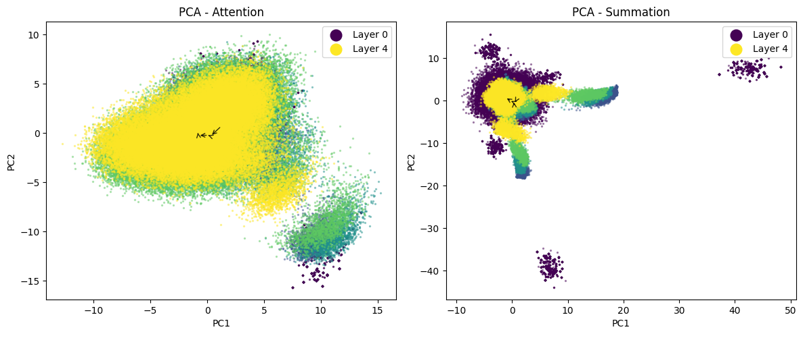

# Summation-Based Transformers: Toward Linear Complexity Sequence Modeling

[](https://opensource.org/licenses/MIT)
[](https://www.python.org/downloads/)

## Overview

This repository implements **summation-based aggregation**, a simple alternative to self-attention that reduces per-layer complexity from O(n²d) to O(nd).  
Instead of computing pairwise similarities, tokens are modulated by learned positional encodings, projected through bias-free layers with nonlinearities, and aggregated by **direct summation**.  

On its own, summation is competitive in classification and multimodal settings. In autoregressive language modeling, a **hybrid design**—summation in most layers with a single attention layer at the output—matches or slightly exceeds full-attention performance while remaining nearly linear in cost.

## Key Points

- **Near-linear scaling**: O(n·d) vs. O(n²·d) for attention  
- **Hybrid-friendly**: most layers use summation, a final layer uses attention  
- **Drop-in compatible**: summation can replace attention inside transformer blocks without altering residuals, norms, or optimizers  
- **Broad applicability**: tested across classification, language modeling, and multimodal regression  

## Quick Start

```bash
git clone https://github.com/pfekin/summation-based-transformers
cd summation-based-transformers
pip install -r requirements.txt

# Run language modeling benchmark
python causal.py

# Run classification benchmark
python classifier.py

# Run multimodal regression benchmark
python multimodal.py
````

### Google Colab

```python
!pip install --upgrade datasets fsspec huggingface_hub
!pip install git+https://github.com/pfekin/summation-based-transformers
```

## Experimental Highlights

- **Classification**: With a context window of 512 tokens, summation performs on par with attention while running up to ~18× faster (CPU and GPU).  
- **Language Modeling**: Pure summation lags behind, but a hybrid design (summation + one attention layer) closes the gap and sometimes outperforms full attention.  
- **Multimodal Regression**: Summation provides a shared channel across text and metadata, yielding competitive results with fewer parameters and faster training.  

## Representation

Summation layers restructure embeddings differently from attention: instead of gradual refinement, they show sharper shifts and alternating contraction–expansion of representational dimensionality.  

<div align="center">
  
  <p><em>PCA trajectories of embeddings across layers. Summation restructures the manifold before the final attention layer stabilizes it.</em></p>
</div>

## Requirements

* Python 3.8+
* PyTorch 1.9+ (or TensorFlow with CUDA support)
* transformers, scikit-learn, numpy, matplotlib, datasets, fsspec, huggingface\_hub

## Reference

For details, see:
**Pascal Ekin, "Summation-Based Transformers: A Path Toward Linear Complexity Sequence Modeling," TechRxiv, 2025.**
[📄 Download Paper](https://doi.org/10.36227/techrxiv.175790522.25734653/v1)

```bibtex
@article{Summation_Based_Transformers_2025,
  title={Summation-Based Transformers: A Path Toward Linear Complexity Sequence Modeling},
  author={Pascal Ekin},
  journal={TechRxiv},  
  year={2025},
  doi={10.36227/techrxiv.175790522.25734653/v1},  
  url={https://doi.org/10.36227/techrxiv.175790522.25734653/v1},
}
```

## License

MIT License — see the [LICENSE](LICENSE) file.

## Contact

* **Author**: Pascal Ekin
* **Email**: [pfekin@gmail.com](mailto:pfekin@gmail.com)
* **Issues**: Use the GitHub issue tracker for bugs/requests
