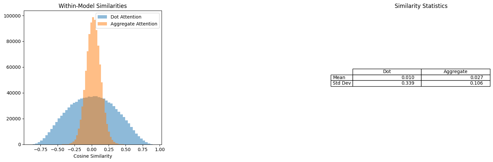

# High-Dimensional Aggregation for Efficient Sequence Modeling  

[](LICENSE)  

> **Sub-quadratic sequence modeling** through high-dimensional embeddings and geometric orthogonality. Matches attention performance with **7–20× faster computation**.

---

## 🚀 Key Features  
- **Linear complexity** O(n·d) vs. O(n²·d)
- **Position-semantic fusion** via element-wise multiplication  
- **Emergent orthogonality**: Self-organized token embeddings  
- **Derrida-aligned latent space**: Meaning through relational contrasts  

---

## 📊 Performance Highlights  

### Cosine Similarity Distribution (Aggregation vs. Attention)  
  
*Token embedding orthogonality emerges naturally*

---

## ⚙️ Core Mechanics  

### Position-Semantic Fusion  
Combines token embeddings (**eₜ**) and positional encodings (**pₜ**) via:  
**ContextVector** = Σₜ₌₁ⁿ (eₜ ⊙ pₜ)  
- **⊙**: Element-wise multiplication  
- Preserves both position and semantics through multiplicative interaction  


### Training Dynamics  
The optimizer achieves dual objectives:  
1. **Minimizes semantic clash** through emergent orthogonality  
2. **Maintains positional fidelity** via element multiplication  

---

## 🌐 Philosophical Alignment  

| Concept               | Implementation                   | 
|-----------------------|-----------------------------------|
| Derrida's *différance*| Meaning through vector contrasts |
| Atlan's crystal-smoke | Orthogonal structure + training chaos |
| Deleuze's multiplicity| Superposition without collision   |

---

## 🧪 Benchmark Results  

| Task            | Aggregation | Attention | Speedup |  
|-----------------|-------------|-----------|---------|  
| Reuters Classification (Validation Accuracy) | 78.63%      | 77.96%     | 20.0×    |  
| AG News Autoregression (Validation Perplexity) | 2.99  (less is better)    | 3.15     | 1.5×     |  
---

## 🛠️ Implementation  
```python  

# Aggregation
class Aggregation(layers.Layer):
    def __init__(self, d_model, projection=True, noise_stddev=0.0):
        super().__init__()
        self.d_model = d_model
        self.projection = projection
        self.proj = layers.Dense(d_model, activation='linear', use_bias=False) if projection is not None else None
        self.noise = layers.GaussianNoise(noise_stddev, seed=None)
        
    def call(self, x, mask=None, training=None):
        x = self.proj(x) if self.projection else x
             
        if mask is not None:
            # Convert mask to float32 and use it to zero out future positions
            mask = tf.cast(mask, tf.float32)
            
            # Aggregate using matrix multiplication (avoids 4D tensor)
            x = tf.einsum('bij,bjf->bif', mask, x)  # (batch, seq_len, d_model*expansion)
        else:
            x = tf.reduce_sum(x, axis=1, keepdims=True)
            
        x = self.noise(x, training=training)
        return x  # (batch, seq_len, d_model)
```
## 📚 Future Directions  
1. Embedding dimension vs. sequence length tradeoffs  
2. Extending to multimodal inputs (text, vision, audio)
3. Use in a diffusion model

---

## 📦 Installation  
```bash  
git clone https://github.com/yourusername/high-dimensional-aggregation  
pip install -r requirements.txt  
```
## 📜 License  
MIT © Pascal Ekin. See [LICENSE](LICENSE) for details.  	
